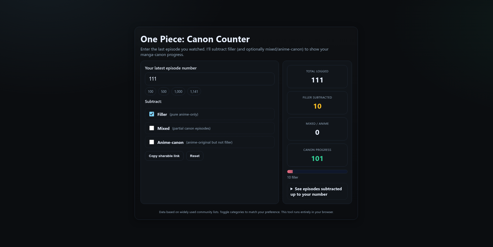

# One Piece — Canon Counter

A tiny, single-file web page that lets you enter your latest **One Piece** episode and instantly shows your **manga-canon progress** by subtracting filler (and, optionally, mixed/anime-canon episodes). No builds, no server, no tracking—just open `index.html`.

 <!-- optional; remove if you don't commit a screenshot -->

---

## ✨ Features

- **One file**: everything in `index.html`
- **Client-side only**: works offline, nothing leaves your browser
- **Toggle categories**: subtract *Filler*, *Mixed*, and/or *Anime-canon*
- **Shareable links**: settings are encoded in the URL
- **Autosave**: last input + toggles persist via `localStorage`
- **Responsive UI**: looks good on desktop and mobile

---

## 🚀 Quick Start

1. Download or copy `index.html` from this repo.
2. Open it in any modern browser (Chrome, Edge, Firefox, Safari).
3. Enter the last episode you watched.
4. Use the toggles to choose which categories to subtract.

> Tip: The “Copy sharable link” button lets you bookmark or send your exact settings.


---

## 🧭 How it works

- The page stores known episode ranges for three categories:
  - `FILLER` — pure anime-only stories
  - `MIXED` — episodes mixing canon and non-canon elements
  - `ANIME_CANON` — anime-original but not considered “filler”
- Given your episode `N`, it subtracts the count of every episode ≤ `N`
  that falls into the enabled categories and shows the **Canon progress**.

Everything runs in your browser; there’s no backend or API.

---

## 🔗 URL Parameters

You can prefill the page and toggles via query params:

- `count` — latest episode number (integer)
- `f` — subtract filler (1/0)
- `m` — subtract mixed (1/0)
- `a` — subtract anime-canon (1/0)

**Example:**

```
index.html?count=171&f=1&m=0&a=0
```

---

## 🛠️ Updating the lists

Open `index.html` and edit the arrays near the bottom:

```js
// Episode ranges (inclusive)
const FILLER = [
  [54,60], [98,99], /* ... */
];

const MIXED = [
  [45,47], [61,61], /* ... */
];

const ANIME_CANON = [
  [50,51], [93,93], /* ... */
];
```

Each pair `[start, end]` means “from start to end, inclusive”.
To add a single episode, use `[102,102]`.

> Classification can vary slightly between sources. If your preferred guide
> differs, just adjust the ranges to match that source.

---

## 📦 Development

There’s no build step. If you want to tweak styles/scripts:

- Edit inline `<style>` and `<script>` in `index.html`
- Test by opening the file directly in your browser
- Commit and push—done

---

## ❓ FAQ

**Why does my canon count differ from another website?**  
Different sources sometimes classify certain recap/special/mixed episodes differently.
This tool is intentionally editable so you can align it with your preferred list.

**Does this collect analytics or use cookies?**  
No. It uses `localStorage` only to remember your input and toggle preferences on your device.

**Does it work offline?**  
Yes—once you have `index.html`, you can run it without internet.

---

## 🔒 Privacy

- No network calls, no external dependencies.
- State is stored locally in your browser (`localStorage`).
- Shareable URLs include your current inputs and toggles (so treat them like any link).

---

## 📝 License

MIT — see `LICENSE` (or choose a different license if you prefer).